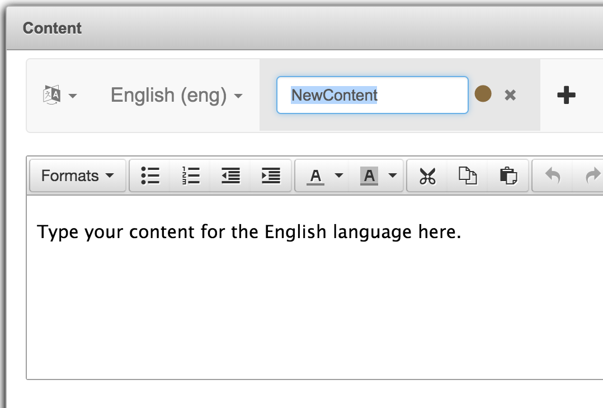

# Content Dialog

**The Content dialog allows the user to create reusable blocks of formatted text and images that can be displayed to players.**

During the course of an experiment you will want to display tutorial, instruction, and result text on the player's screen. The Content dialog makes it easy to set up these blocks of text using a WYSIWYG (what you see is what you get) interface. 

To create a new block of content, click the "+" button, enter a name for the content, and press Enter.



Click the new tab in order to select it and edit the text using the WYSIWYG toolbar. Click the "Save" button when you are done editing the content.

To display this content to the players use the `get` method of the `c` global object to retrieve the content and apply it to the `text` property of each player node:

```groovy
g.V.each { v->
  v.text = c.get("Tutorial1")
}
```

There may be cases where you want to insert values into the content based on the experiment instance's parameters or the current state of the game. Use placeholders in the content in the format `{n}` where n is a number starting with 0 that refers to the index of the argument you will provide to the `c.get` method.

To fetch the content while replacing the placeholders, provide one or more additional arguments to the `c.get` method:

```groovy
g.V.each { v->
  v.text = c.get("CooperationStep",50,100)
}
```

In the previous example the first placeholder `{0}` will be replaced with the number 50 and the second placeholder `{1}` will be replaced with the number 100 resulting in the text: "If you click 'Cooperate' you will pay 50 points for each of your neighbors and give them 100 points each."

To delete a block of content, click the "x" icon on the tab of the content you wish to delete and click "Confirm" to confirm the deletion. 

