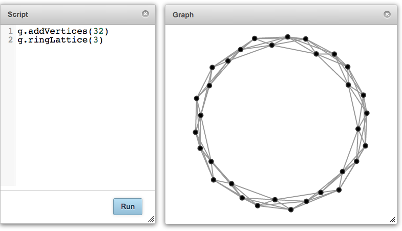

# Script Dialog
**The script dialog allows the user to execute code and interact with the graph and players.**

The scripting language is a graph traversal DSL based on [Gremlin](http://gremlindocs.com) which is built on top of the [Groovy](http://www.groovy-lang.org/) programming language.

For example, type the following into the Script dialog and click the Run button:

```groovy
g.addVertices(32)
g.ringLattice(3)
```

This code adds 32 nodes to the graph and arranges them in a ring lattice structure.



In the graph visualization, each node represents a player in the game and the ties show who will be playing with who.

### Video:

<iframe width="750" height="480" src="https://www.youtube.com/embed/ihMFqfL8HW0" title="YouTube video player" frameborder="0" allow="accelerometer; autoplay; clipboard-write; encrypted-media; gyroscope; picture-in-picture" allowfullscreen></iframe>
