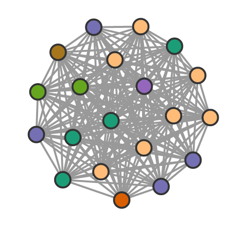
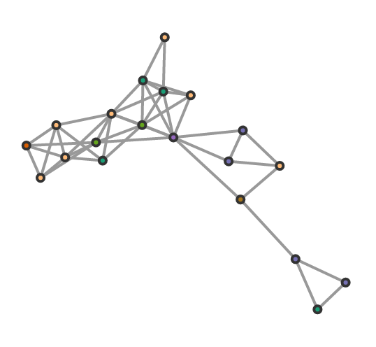
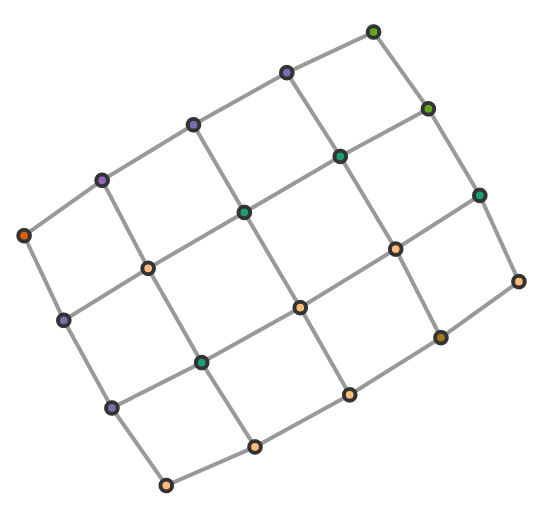
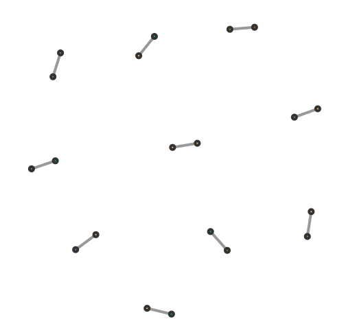
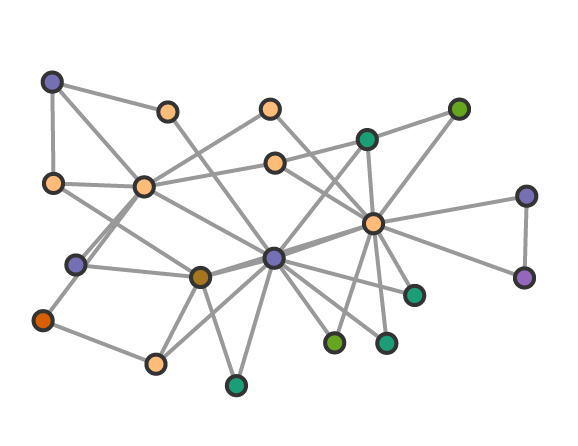
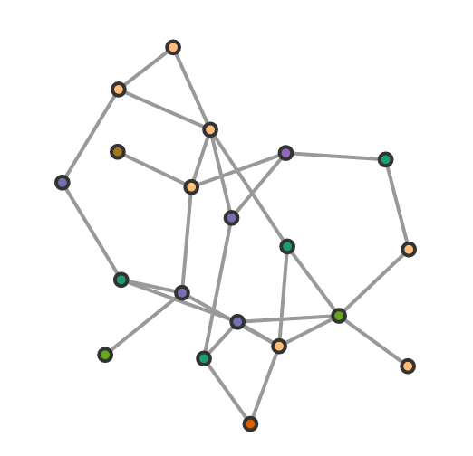
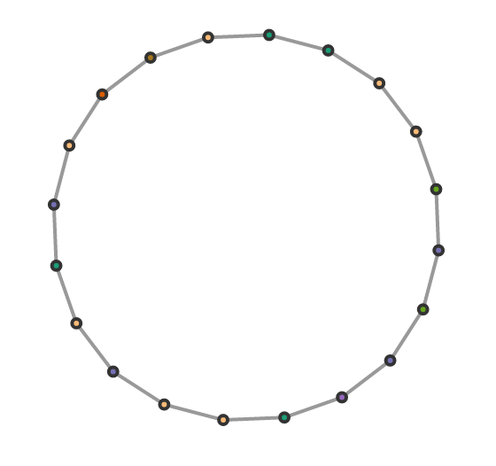
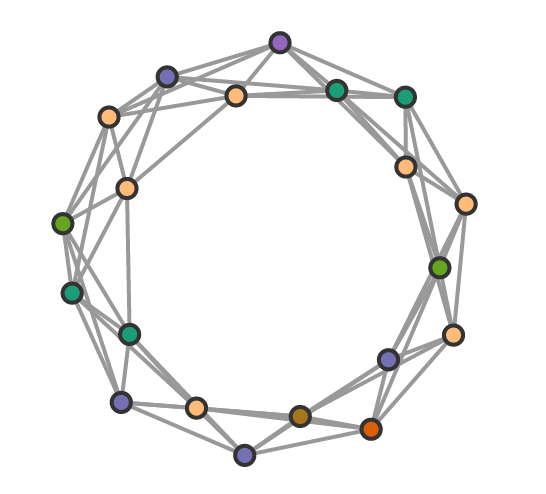
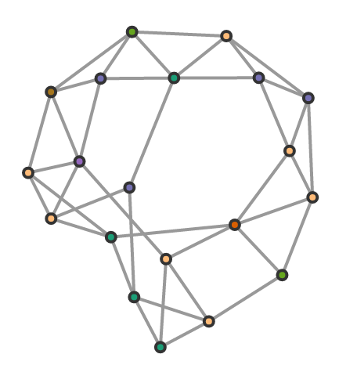
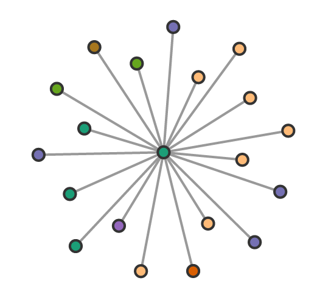

# Graph Algorithms

| Graph                                        | Documentation                                    | Result                                                                                    |
|----------------------------------------------|--------------------------------------------------|-------------------------------------------------------------------------------------------|
| Complete                                     | **g.complete()**                                 |                                           |
| Geometric Random                             | **g.geometricRandom([distance: 0 - 1])**         |                                  |
| Grid                                         | **g.grid()**                                     |                                                         |
| Ladder                                       | **g.ladder()**                                   |                                               |
| Pairs                                        | **g.pairs()**                                    |                                                       |
| Preferential Attachment (Barabási–Albert)    | **g.barabasiAlbert([edges per node])**           |             |
| Random (Erdős–Rényi)                         | **g.random([probability: 0 - 1])**               |                                               |
| Ring                                         | **g.ring()**                                     |                                                   |
| Ring Lattice                                 | **g.ringLattice([degree of nodes to connect])**  |                                   |
| Small World (Watts-Strogatz)                 | **g.wattsStrogatz([degree], [probability: 0-1])**|                                     |
| Star                                         | **g.star()**                                     |                                                   |
| Wheel                                        | **g.wheel()**                                    |                                                 |
